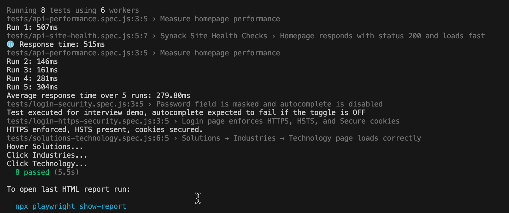

# 🔐 Synack Playwright Framework (Portfolio Project)

### Author: Nadezhda “Nadya” Koltakova: QA Manager & SDET

---

## Overview

This project demonstrates a clean, scalable **Playwright automation framework** with:

- UI testing
- API testing
- Security-aware testing for authentication flows
- Performance testing using **k6**
- Page Object Model + Component Object Model design

**Note:**  
This framework is for portfolio and educational purposes only. It tests only **publicly accessible Synack domains**.

---

## Tech Stack

- JavaScript (ES6+)
- Node.js
- Playwright Test Runner
- k6 (performance testing)
- Page Object Model (POM)
- Component Model
- API request testing

---

## Folder Structure

```
pages/ # Page Objects
components/ # Reusable UI components
tests/ # UI, API, security test suites
performance-tests/ # k6 performance testing scripts
utils/ # Helpers
playwright.config.js # Configuration
```

---

## 🛠️ Installation

```bash
npm install
npx playwright install

---

## Run Tests
UI Tests (headed mode)

```
npx playwright test --headed
```

UI Tests (CI / headless mode)

```
npx playwright test
```

API Tests

```
npx playwright test tests/api-site-health.spec.js
```

Security Tests

```
npx playwright test tests/login-security.spec.js
```

Run k6 Performance Tests

```
k6 run performance-tests/k6-load-test.js
k6 run performance-tests/k6-spike-test.js
k6 run performance-tests/k6-stress-test.js
k6 run performance-tests/k6-mixed-multi-api-test.js
```
---

### Test Execution Screenshot



---

## UI Test Coverage

- Homepage UI checks
- Navigation: Solutions → Industries → Technology
- Strict locator usage (`getByRole`, `getByLabel`, attribute selectors)
- URL and title assertions

---

## Security Test Coverage

- HTTP → HTTPS redirect validation
- HSTS enforcement (`strict-transport-security`)
- Cookie security flags:
  - Secure
  - HttpOnly
  - SameSite
- Password masking
- Autocomplete validation

These tests demonstrate awareness of **OWASP Authentication** weaknesses.

---

## API Test Coverage

Using Playwright’s `request` fixture:

- Endpoint health checks
- Status assertions
- Response body validation
- Basic performance timing

---

## Performance Testing (k6)

Includes realistic performance scenarios:

- Load test
- Spike test
- Stress test
- Multi-endpoint API flow


